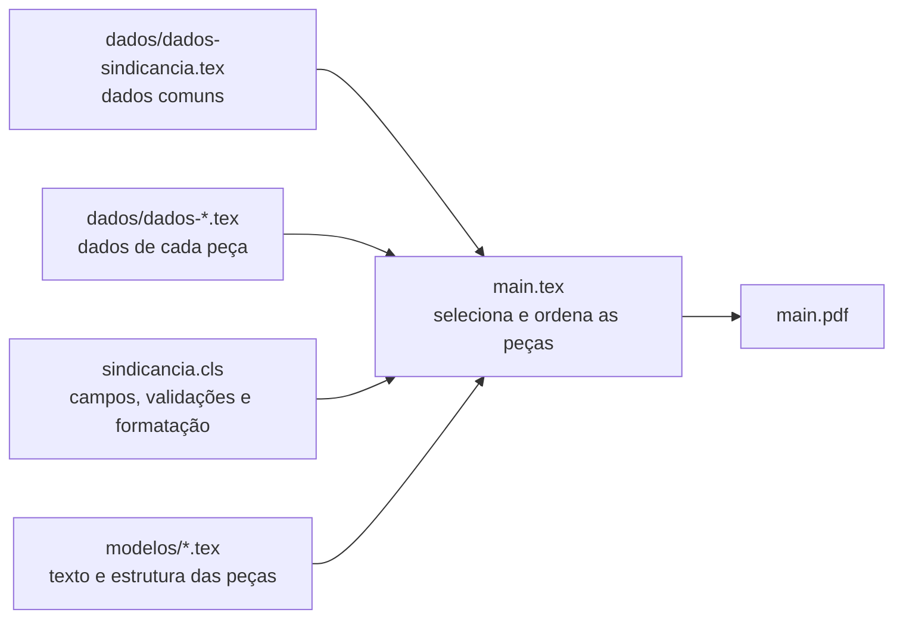

# Sindicância EB em LaTeX

[](https://github.com/rafazildod/sindicanciaEB/actions/workflows/latex.yml)
[](LICENSE)
[](https://github.com/rafazildod/sindicanciaEB/releases/latest)

Modelos em LaTeX para produzir e padronizar peças de sindicância no âmbito do Exército Brasileiro, com base nos anexos da **EB10-IG-09.001 (2ª edição, 2024)**.

O projeto separa o conteúdo da formatação: o usuário preenche arquivos simples na pasta `dados/`, escolhe as peças no `main.tex` e compila um PDF. Não é necessário alterar os modelos nem a classe LaTeX para o uso normal.

[Consultar o PDF demonstrativo](https://github.com/rafazildod/sindicanciaEB/releases/latest/download/sindicanciaEB-demo.pdf), produzido somente com dados fictícios.

> [!IMPORTANT]
> Este é um projeto independente e não oficial. Ele auxilia na preparação material dos documentos, mas não substitui a norma vigente, a orientação da autoridade competente nem a revisão jurídica e administrativa de cada caso.

Consulte também o [mapa de conformidade e aplicabilidade](docs/CONFORMIDADE-EB10-IG-09.001.md).
As incompatibilidades e orientações de migração da versão 2.0.0 estão no [histórico de versões](CHANGELOG.md).

## O que o projeto oferece

- modelos aplicáveis dos anexos A a AA da EB10-IG-09.001, com a juntada compartilhada pelos anexos E e L;
- modelos auxiliares de DIEx, Ofício, relatório complementar, notificação da solução, prorrogação e consentimento para acesso a prontuário;
- dados separados da apresentação visual;
- estado formal de rito, natureza, parte principal, sigilo e transições;
- suporte a apuração sem sindicado e à posterior conversão para natureza processual;
- modos de texto padrão, adaptado e personalizado sem editar `modelos/*.tex`;
- validação de datas, cronologia, prazos, aplicabilidade e placeholders;
- inclusão de PDFs digitalizados nas juntadas;
- foliação automática ou manual, com campo de rubrica;
- matriz de testes com cenários normativos positivos e negativos.

## Antes de começar: proteja os dados

O repositório público contém somente dados fictícios. Para uma sindicância real:

1. trabalhe em uma cópia **privada** do projeto;
2. não publique nomes, CPF, identidade, endereço, telefone, depoimentos, documentos médicos ou PDFs dos autos;
3. confira o PDF completo antes de imprimir, assinar ou encaminhar;
4. mantenha cópias de segurança conforme as regras da sua organização militar.

O `.gitignore` reduz o risco de publicar arquivos gerados e PDFs reais em `documentos/`, mas ele não protege dados pessoais digitados nos arquivos `.tex`. A responsabilidade pela conferência continua sendo do usuário.

## Início rápido

### 1. Instale o LaTeX

Você precisa de uma distribuição LaTeX recente, como **TeX Live** ou **MiKTeX**, com LuaLaTeX.

Depois da instalação, abra o PowerShell, Terminal ou Prompt de Comando e confirme:

```bash
lualatex --version
```

A classe usa `fontspec` e, por isso, **não funciona com pdfLaTeX**. Times New Roman é usada quando está instalada; na ausência dela, o projeto tenta Liberation Serif e depois TeX Gyre Termes.

### 2. Baixe o projeto

Se você usa Git:

```bash
git clone https://github.com/rafazildod/sindicanciaEB.git
cd sindicanciaEB
```

Se não usa Git, escolha **Code > Download ZIP** na página do repositório e extraia o arquivo. Os comandos seguintes devem ser executados dentro da pasta extraída.

### 3. Preencha os dados gerais

Abra `dados/dados-sindicancia.tex` em um editor de texto, como Visual Studio Code, TeXstudio ou TeXworks. Substitua os textos em maiúsculas e os números fictícios pelos dados do caso.

Nesse arquivo ficam os dados reutilizados por várias peças:

- regime normativo, rito, natureza, parte principal e sigilo;
- data e local de abertura dos trabalhos;
- organização militar;
- NUP, portaria e objeto;
- autoridade instauradora;
- sindicante, sindicado e escrivão.

Se a apuração ainda não tiver sindicado, use `\naturezaSindicancia{investigatoria}`, `\partePrincipalSindicancia{nenhuma}` e deixe os campos do sindicado vazios. Não use documentos reservados ao contraditório até que a condição seja alterada formalmente.

### 4. Escolha e preencha uma peça

Para gerar a capa, por exemplo, abra:

```text
dados/dados-anexo-c-capa.tex
```

Cada peça possui um arquivo equivalente na pasta `dados/`. O [mapa de documentos](#mapa-de-documentos) mostra as correspondências.

### 5. Ative a peça no `main.tex`

No `main.tex`, encontre o bloco desejado e retire o `%` do início destas duas linhas:

```latex
\input{dados/dados-anexo-c-capa.tex}
\GerarDocumento{capa}
```

Sempre ative o par completo: a primeira linha carrega os dados e a segunda gera o documento. Você pode ativar várias peças; elas serão reunidas no mesmo PDF, na ordem em que aparecem no `main.tex`.

### 6. Gere o PDF

Na raiz do projeto, execute duas vezes:

```bash
lualatex main.tex
lualatex main.tex
```

O resultado será `main.pdf`.

Também é possível usar:

```bash
latexmk -lualatex -halt-on-error -interaction=nonstopmode main.tex
```

### 7. Faça a conferência final

Confira nomes, números, datas, paginação, anexos, campos em branco e assinaturas. O sistema formata o conteúdo informado, mas não verifica se os fatos, prazos ou fundamentos jurídicos estão corretos.

## Como o projeto funciona



- `dados/`: conteúdo editável pelo usuário;
- `modelos/`: texto e estrutura visual de cada documento;
- `sindicancia.cls`: comandos, validações e regras comuns de formatação;
- `main.tex`: painel que escolhe a ordem e as peças a gerar;
- `tests/all-models.tex`: compilação de regressão com todos os modelos.

No uso cotidiano, altere principalmente `dados/` e `main.tex`.

## Estrutura do repositório

```text
sindicanciaEB/
├── main.tex                 # painel de uso
├── sindicancia.cls          # classe e API do projeto
├── sindicancia-procedimento.tex # estado e regras procedimentais
├── dados/                   # campos gerais e dados de cada peça
├── modelos/                 # modelos LaTeX dos documentos
├── documentos/              # PDFs inseridos em juntadas
├── bases/                   # referências normativas e modelos de origem
├── figs/                    # elementos gráficos
└── tests/all-models.tex     # teste de todos os modelos
```

## Mapa de documentos

| Anexo | Documento | Dados | Modelo |
|---|---|---|---|
| A | Portaria de instauração | `dados/dados-anexo-a-portaria-instauracao.tex` | `modelos/portaria-instauracao.tex` |
| B | Portaria decorrente de denúncia anônima | `dados/dados-anexo-b-portaria-denuncia-anonima.tex` | `modelos/portaria-denuncia-anonima.tex` |
| C | Capa dos autos | `dados/dados-anexo-c-capa.tex` | `modelos/capa.tex` |
| D | Termo de abertura | `dados/dados-anexo-d-termo-abertura.tex` | `modelos/termo-abertura.tex` |
| E/L | Juntada | `dados/dados-anexo-e-l-juntada1.tex` | `modelos/juntada.tex` |
| F | Designação de escrivão | `dados/dados-anexo-f-designacao-escrivao.tex` | `modelos/designacao-escrivao.tex` |
| G | Compromisso de escrivão | `dados/dados-anexo-g-compromisso-escrivao.tex` | `modelos/compromisso-escrivao.tex` |
| H | Despacho | `dados/dados-anexo-h-despacho1.tex` | `modelos/despacho.tex` |
| I | Notificação prévia | `dados/dados-anexo-i-notificacao-previa1.tex` | `modelos/notificacao-previa.tex` |
| J | Notificação de novo sindicado | `dados/dados-anexo-j-notificacao-novo-sindicado.tex` | `modelos/notificacao-novo-sindicado.tex` |
| K | Notificação de diligências complementares | `dados/dados-anexo-k-notificacao-diligencias-complementares.tex` | `modelos/notificacao-diligencias-complementares.tex` |
| M | Comparecimento de sindicado | `dados/dados-anexo-m-comparecimento-sindicado.tex` | `modelos/comparecimento-sindicado.tex` |
| N | Comparecimento de testemunha | `dados/dados-anexo-n-comparecimento-testemunha.tex` | `modelos/comparecimento-testemunha.tex` |
| O | Carta precatória | `dados/dados-anexo-o-carta-precatoria1.tex` | `modelos/carta-precatoria.tex` |
| P | Inquirição de testemunha | `dados/dados-anexo-p-inquiricao-testemunha1.tex` | `modelos/termo-inquiricao-testemunha.tex` |
| Q | Inquirição de sindicado | `dados/dados-anexo-q-inquiricao-sindicado1.tex` | `modelos/termo-inquiricao-sindicado.tex` |
| R | Substituição de sindicante | `dados/dados-anexo-r-substituicao-sindicante.tex` | `modelos/substituicao-sindicante.tex` |
| S | Acareação | `dados/dados-anexo-s-acareacao.tex` | `modelos/acareacao.tex` |
| T | Encerramento de instrução | `dados/dados-anexo-t-encerramento-instrucao.tex` | `modelos/termo-encerramento-instrucao.tex` |
| U | Vista para alegações finais | `dados/dados-anexo-u-vista-alegacoes-finais.tex` | `modelos/vista-alegacoes-finais.tex` |
| V | Certidão | `dados/dados-anexo-v-certidao.tex` | `modelos/certidao.tex` |
| W | Relatório | `dados/dados-anexo-w-relatorio.tex` | `modelos/relatorio.tex` |
| X | Termo de encerramento | `dados/dados-anexo-x-termo-encerramento.tex` | `modelos/termo-encerramento.tex` |
| Y | DIEx de remessa | `dados/dados-anexo-y-diex-remessa.tex` | `modelos/diex-remessa.tex` |
| Z | Solução | `dados/dados-anexo-z-solucao.tex` | `modelos/solucao-sindicancia.tex` |
| AA | Certidão de modificação do rito | `dados/dados-anexo-aa-certidao-modificacao-rito.tex` | `modelos/certidao-modificacao-rito.tex` |

### Modelos auxiliares

| Documento | Dados | Modelo |
|---|---|---|
| DIEx genérico | `dados/dados-diex1.tex` | `modelos/diex.tex` |
| Ofício genérico | `dados/dados-oficio1.tex` | `modelos/oficio.tex` |
| Relatório complementar | `dados/dados-relatorio-complementar.tex` | `modelos/relatorio-complementar.tex` |
| Notificação da solução | `dados/dados-notificacao-solucao.tex` | `modelos/notificacao-solucao.tex` |
| Consentimento para acesso a prontuário | `dados/dados-termo-consentimento-prontuario.tex` | `modelos/termo-consentimento-prontuario.tex` |
| Solicitação de prorrogação | `dados/dados-solicitacao-prorrogacao.tex` | `modelos/solicitacao-prorrogacao.tex` |

Use um modelo auxiliar somente quando não houver anexo específico aplicável.

## Estado processual e transições

O estado inicial é definido em `dados/dados-sindicancia.tex`:

```latex
\dataPublicacaoPortariaISO{20260501}
\dataRecebimentoPortariaISO{20260502}
\ritoSindicancia{ordinario}             % ordinario ou sumario
\naturezaSindicancia{investigatoria}    % investigatoria ou processual
\partePrincipalSindicancia{nenhuma}     % nenhuma, interessado ou sindicado
\classificacaoSindicancia{ostensiva}    % ostensiva ou sigilosa
```

Quando surgir um sindicado, preencha sua qualificação e registre a conversão antes da primeira peça processual:

```latex
\converterParaProcessual{10 de maio de 2026}{fundamento objetivo da conversão}
```

No rito sumário, a mudança para o ordinário deve preceder o Anexo AA:

```latex
\converterRitoParaOrdinario{10 de maio de 2026}{novas provas necessárias}
```

## Texto padrão, adaptado ou personalizado

Os arquivos em `dados/` podem controlar o texto sem alterar o modelo:

```latex
\modoDocumento{padrao}
```

```latex
\modoDocumento{adaptado}
\textoComplementarDocumento{Parágrafo adicional exigido pelo caso concreto.}
```

```latex
\modoDocumento{personalizado}
\textoDocumentoPersonalizado{Texto integral adequado à peça concreta.}
```

A identificação, os cabeçalhos, as datas, as assinaturas e as validações permanecem sob controle do projeto. A certidão também aceita `\certidaoTexto{...}` para ocorrências diferentes do decurso de prazo.

## Datas dos documentos

A data em `dados/dados-sindicancia.tex` representa a abertura ou o início dos trabalhos e serve como padrão para as peças:

```latex
\dia{00}
\mes{mês}
\ano{2026}
\cidade{CIDADE/UF}
```

Cada documento deve informar sua data própria e uma chave cronológica:

```latex
\dataDocumento{05}{junho}{2026}{CIDADE/UF}
\chaveCronologica{20260605}
```

O projeto rejeita peças sem data específica ou colocadas antes de outra com chave anterior. A capa é a exceção, pois não representa um ato cronológico.

Nos termos em formato de ata, alguns campos aceitam a data por extenso. Se o campo textual ficar vazio, o modelo tenta montá-la a partir de `\dataDocumento` ou da data geral.

## Documentos que se repetem

Para uma segunda testemunha, novo despacho, nova juntada ou outro documento repetido:

1. copie o arquivo de dados correspondente;
2. altere o número no nome, por exemplo de `dados/dados-diex1.tex` para `dados/dados-diex2.tex`;
3. preencha os novos dados;
4. adicione ou duplique o par `\input` + `\GerarDocumento` no `main.tex`.

Arquivos de dados repetíveis começam com um comando de limpeza, como `\novoDiex`, `\novoDespacho` ou `\novaJuntada`. Mantenha esse comando para impedir que dados opcionais da peça anterior sejam reutilizados.

Use os comandos públicos apresentados nos arquivos de exemplo. Não redefina comandos internos iniciados por `\get`.

## Juntadas de documentos

Salve os documentos digitalizados em um único PDF, dentro de `documentos/`. Por padrão:

```latex
\juntadaNumero{1}
```

procura o arquivo:

```text
documentos/docjuntada1.pdf
```

Para a segunda juntada, use `\juntadaNumero{2}` e `documentos/docjuntada2.pdf`. Para outro nome:

```latex
\juntadaArquivo{documentos/nome-do-arquivo.pdf}
```

`documentos/docjuntada1.pdf` é apenas um exemplo fictício. PDFs reais dessa pasta são ignorados pelo Git, com exceção desse arquivo de demonstração.

## Numeração de DIEx e Ofícios

O controle fica em `dados/controle-expedientes.tex`:

```latex
\proximoDiex{005}
\proximoOficio{002}
```

Se o número da peça ficar vazio, o modelo usa o próximo número configurado:

```latex
\diexNumero{}
\oficioNumero{}
```

Após a emissão, registre manualmente o histórico e avance a numeração:

```latex
\registroDiex{005}{05 de junho de 2026}{assunto do DIEx expedido}
\proximoDiex{006}
```

O LaTeX não incrementa números automaticamente. Assim, recompilar o mesmo PDF não consome um novo número.

## Perguntas e respostas nas inquirições

Use:

```latex
\PergResp{tinha conhecimento dos fatos}{sim, tomou conhecimento após ser notificado}
```

ou:

```latex
\PergRespAberta{como os fatos ocorreram}{relatou que...}
```

## Validar todos os modelos

Antes de enviar uma alteração ao projeto, compile a suíte de regressão a partir da raiz:

```bash
latexmk -lualatex -halt-on-error -interaction=nonstopmode -outdir=build tests/all-models.tex
```

O PDF de teste será criado em `build/all-models.pdf`. O teste confirma que os modelos compilam em conjunto com os dados fictícios; ele não valida juridicamente o conteúdo.

O GitHub Actions executa também cenários sem sindicado, de conversão, dos dois ritos, de sigilo, de inquirição especial e dos três modos de texto. Testes negativos confirmam que o projeto rejeita uso processual sem sindicado, regime anterior a 2025, cronologia invertida, prorrogação intempestiva e inquirição excessiva sem pausa ou continuação.

A opção de classe `permitir-placeholders` existe exclusivamente para a suíte de regressão e para demonstrações públicas. Não a use em documentos reais.

## Termo médico e LGPD

O termo de consentimento para acesso a prontuário é um modelo auxiliar sujeito à aprovação local. Ele exige finalidade específica, escopo dos documentos, período, destinatários, retenção, controlador e canal para exercício de direitos.

Consulte a [revisão técnica sob a perspectiva da LGPD](docs/REVISAO-JURIDICA-LGPD.md). Essa análise não substitui a manifestação do setor jurídico nem do encarregado de dados da organização militar.

## Problemas comuns

### Nenhum PDF foi criado

O `main.tex` começa com todas as peças comentadas. Ative pelo menos um par `\input` + `\GerarDocumento`.

### Erro relacionado a `fontspec`

O arquivo foi compilado com pdfLaTeX. Selecione LuaLaTeX ou XeLaTeX.

### `lualatex` não é reconhecido

A distribuição LaTeX não está instalada ou não foi adicionada ao `PATH`. Reinicie o terminal depois da instalação e tente `lualatex --version`.

### Modelo não encontrado

Confira a grafia em `\GerarDocumento{nome-do-modelo}` e verifique se existe `modelos/nome-do-modelo.tex`.

### Arquivo da juntada não encontrado

Confira `\juntadaNumero`, o nome do PDF e a pasta `documentos/`. Compile sempre a partir da raiz do repositório.

### Campo obrigatório ausente

Leia a mensagem de erro, localize o comando correspondente em `dados/dados-sindicancia.tex` ou no arquivo específico da peça e preencha seu valor.

### Caracteres especiais causam erro

Em texto LaTeX, alguns caracteres têm função especial. Quando necessários como texto, use `\%`, `\&`, `\_`, `\#` e `\$`.

## Base normativa e prazos

A pasta `bases/` contém os anexos de referência em DOCX e uma cópia da EB10-IG-09.001 usada no desenvolvimento.

Esta versão do projeto aplica a EB10-IG-09.001 (2ª edição, 2024) às portarias publicadas a partir de 1º de janeiro de 2025. Casos anteriores devem seguir o regime normativo anterior. A solicitação de prorrogação exige fundamentação, relação dos atos realizados e registro de antecedência mínima de 48 horas.

Antes de usar essas informações em um caso real, confirme:

- se a norma disponível no repositório continua vigente;
- a data de recebimento ou ciência da portaria;
- a data efetiva de abertura;
- o calendário de expediente da OM;
- publicações e decisões sobre prorrogação.

O projeto registra e valida algumas condições objetivas, mas não substitui a conferência do calendário, dos marcos de contagem nem das normas especiais aplicáveis.

## Contribuições

Correções e novos modelos são bem-vindos. Ao propor uma mudança:

1. mantenha apenas dados fictícios;
2. preserve a separação entre `dados/`, `modelos/` e `sindicancia.cls`;
3. compile `tests/all-models.tex`;
4. descreva a referência normativa ou o problema corrigido no pull request.

Para relatar um erro, abra uma issue informando o modelo, o compilador usado e o trecho relevante do log — sempre removendo dados pessoais e conteúdo sigiloso.

## Licença e conteúdo de terceiros

O código, a classe LaTeX, os modelos e a documentação original são disponibilizados sob a [licença MIT](LICENSE).

Os materiais de `bases/` e o elemento gráfico de `figs/` **não são relicenciados** pela licença MIT. Consulte [THIRD_PARTY_NOTICES.md](THIRD_PARTY_NOTICES.md) antes de copiar, redistribuir ou adaptar esses itens.
